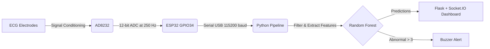

# 🫀 AI-Based Real-Time ECG Anomaly Detection System


> **Final Year Project** — ESP32 + AD8232 + Random Forest + Real-Time Web Dashboard  
> 🔗 [View Presentation Slides](https://docs.google.com/presentation/d/1WCODxqY1NNHRyLQVIZKMnhqAkkMkOI6z_rHUC1bUbVA/edit?usp=sharing)

---

## 🔬 System Overview

The system streams real-time ECG data from an AD8232 sensor via an ESP32 microcontroller to a Python-based processing pipeline. It filters the signal, extracts Heart Rate Variability (HRV) features, and utilizes a pre-trained Random Forest model to detect anomalies. The results are visualized dynamically on a Socket.IO-powered web dashboard.




deepika 

---

## 📁 Project Structure

```text
ECG_Project/
├── firmware/ECG_Firmware/ECG_Firmware.ino   # ESP32 Arduino sketch (Core v3.x ready)
├── src/
│   ├── signal_processing.py                 # Butterworth filter + Pan-Tompkins
│   ├── feature_extraction.py                # 6 HRV features + SQI
│   ├── realtime_inference.py                # Threaded inference engine
│   └── ecg_simulator.py                     # MIT-BIH Demo streamer
├── model/
│   ├── data_preparation.py                  # MIT-BIH → feature CSV
│   ├── model_training.py                    # Train Random Forest
│   └── model_evaluation.py                  # Evaluation + plots
├── dashboard/
│   └── index.html                           # Custom HTML/CSS/JS frontend
├── server.py                                # Flask + Socket.IO backend
├── logs/                                    # Session CSV logs
├── assets/                                  # Plots, confusion matrix
├── tests/                                   # Unit tests
├── requirements.txt                         # Python dependencies
└── conftest.py                              # Pytest configuration
```

---

## ⚡ Hardware Wiring

| AD8232 Pin | ESP32 Pin | Notes |
|:---:|:---:|---|
| **3.3V** | **3V3** | Power |
| **GND** | **GND** | Ground |
| **OUTPUT** | **GPIO34** | ADC input-only, 12-bit |
| **LO+** | **GPIO32** | Lead-off detection |
| **LO-** | **GPIO33** | Lead-off detection |
| **SDN** | — | **Not connected** (Optional) |

> ⚠️ **Buzzer (5V Active Type):** Requires a transistor (BC547/2N2222) switching circuit driven by **GPIO25**.

---

## 🛠 Setup & Installation

### 1. Set up Python Environment & Install Dependencies
Ensure you have **Python 3.11** installed. From the root directory of the project, create a virtual environment and install the required packages:

```bash
# 1. Create a virtual environment
python -m venv venv

# 2. Activate the virtual environment
# On Windows:
venv\Scripts\activate
# On macOS/Linux:
source venv/bin/activate

# 3. Install dependencies
pip install -r requirements.txt
```

### 2. Flash ESP32 firmware
1. Open `firmware/ECG_Firmware/ECG_Firmware.ino` in Arduino IDE.
2. Install **ESP32 board package** (v3.2.0 or later).
3. Select board: `ESP32 Dev Module`.
4. Set baud rate: `115200`.
5. Click **Upload**.

### 3. Train the AI model (one-time setup)
Downloads the MIT-BIH dataset from PhysioNet and trains the Random Forest classifier.
```bash
cd model
python data_preparation.py
python model_training.py
python model_evaluation.py
cd ..
```

---

## 🖥 Running the Dashboard

We use a custom, high-performance web dashboard over WebSockets to ensure zero page reloads.

### 1. Start the Server
Ensure your virtual environment is activated, then from the root directory of the project, run:
```bash
python server.py
```

### 2. Open the Interface
Navigate to your web browser and open:
👉 **http://localhost:5000**

### 3. Controls
| Feature | Location | Description |
|---|---|---|
| **Demo Mode** | Sidebar toggle | Simulates hardware without physical sensors (**enabled by default**). |
| **Live Hardware Mode** | Sidebar | Disable Demo Mode and enter COM port (e.g., `COM3`). |
| **Start/Stop Engine** | Sidebar buttons | Toggles real-time streaming and inference. |
| **Calibration** | Sidebar button | 30s baseline calibration to personalize alerts. |

---

## 🧠 AI Model Specifications

| Parameter | Value |
|---|---|
| Algorithm | Random Forest (scikit-learn) |
| Trees | 100 |
| Features | 6 HRV features |
| Training data | MIT-BIH Arrhythmia Dataset (15 records) |
| Labels | Normal (0) / Abnormal (1) |
| Alert threshold | P(abnormal) > **0.70** |
| Alert trigger | **3 consecutive** abnormal windows |

---

## 🔬 Signal Processing Pipeline

| Stage | Method | Parameters |
|---|---|---|
| **Bandpass filter** | Butterworth (4th order) | 0.5–40 Hz |
| **QRS detection** | Pan-Tompkins | Refractory: 200 ms |
| **Feature extraction** | HRV time-domain | 5-second windows, 50% overlap |
| **Normalisation** | StandardScaler | Fitted on MIT-BIH training data |

---

## 📊 Features Extracted

The following Time-Domain HRV features are utilized for anomaly classification:
1. `heart_rate` — Beats Per Minute (BPM)
2. `rr_mean` — Mean RR interval (ms)
3. `rr_std` — RR variability (ms)
4. `sdnn` — Standard deviation of NN intervals
5. `rmssd` — Root mean square of successive differences
6. `beat_variance` — Beat-to-beat interval variance

---

## 🧪 Running Unit Tests

To run the automated test suite, use pytest from the root directory:
```bash
pytest tests/ -v
```

---

## ⚠️ Important Notes

- 🛑 **This system detects abnormal ECG patterns only — it does NOT diagnose diseases.**
- 🛑 AD8232 single-lead setup is NOT reliable for P-wave or ST-segment analysis.
- The model must always be used with its paired `scaler_v1.pkl` for normalisation.
- Buzzer activates after **3 consecutive abnormal windows** (~15 seconds) to prevent false alarms.
- If electrodes are disconnected, inference is automatically paused.

---
*Built with Python 3.11 · scikit-learn · Flask · Socket.IO · wfdb*
